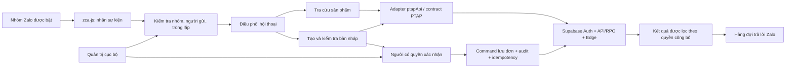

# Kế hoạch dự án ZALO-BOT × PTAP-NEXT

> Ghi chú ngày 01/10/2026: Đây là bản kế hoạch lịch sử lập ngày 08/09/2026. Các trạng thái và mô tả hiện trạng bên dưới phản ánh thời điểm lập, không phải tiến độ hiện tại. Phần tích hợp Zalo đã có implementation trong PTAP-NEXT; cần đối chiếu code, test và log hiện hành của PTAP-NEXT trước khi triển khai task tiếp theo. Chưa tự đánh dấu các task dưới đây hoàn tất.

Phiên bản: 0.1 — ngày 08/09/2026. Trạng thái: **DỰ THẢO ĐỂ CHỐT PHẠM VI**.

Tài liệu này là kế hoạch; các mục ghi “đề xuất” chưa phải quyết định nghiệp vụ đã được duyệt. Chỉ lập kế hoạch ở giai đoạn hiện tại, chưa đăng nhập tài khoản, bật trả lời nhóm, triển khai backend hay tạo đơn thật.

## 1. Mục tiêu và kết quả bàn giao

Dùng một tài khoản Zalo cá nhân do chủ hệ thống đăng nhập để trả lời khách trong các nhóm được chỉ định. Dữ liệu sản phẩm, giá và đơn hàng lấy từ PTAP-NEXT. Yêu cầu đặt hàng được xử lý theo cấu trúc và quy tắc đã chốt cho TOCKY, sau đó đi qua quy trình kiểm tra và lưu đơn có phân quyền.

Kết quả cuối dự kiến:

1. Fork zca-js có mã tích hợp, cấu hình mẫu, hướng dẫn cài đặt và vận hành.
2. Trang quản trị cục bộ: đăng nhập Zalo/PTAP, chọn nhóm, liên kết khách hàng, cấu hình quyền, bật/tạm dừng bot và xem lỗi.
3. Bot tra cứu tiếng Việt, trả kết quả từ PTAP-NEXT và hỏi lại khi chưa xác định đúng sản phẩm.
4. Luồng đề nghị đặt hàng → đơn nháp → kiểm tra/xác nhận → lưu qua API PTAP-NEXT → trả mã đơn thực tế.
5. Nhật ký có thể lần từ tin nhắn Zalo đến bản nháp và đơn hàng; chống tạo đơn trùng khi retry/restart.
6. Báo cáo kiểm thử, UAT với tài khoản/nhóm thử và hướng dẫn khôi phục.

## 2. Hiện trạng đã kiểm tra

| Thành phần | Hiện trạng | Hệ quả cho kế hoạch |
|---|---|---|
| GitHub | Fork `hoangquangthanhxd-del/ZALO-BOT` đã tồn tại, parent là `RFS-ADRENO/zca-js` | Dùng fork này, không tạo thêm repo |
| Local | Đã fetch vào thư mục ZALO-BOT; branch `BRANCH1/zalo-ptap-integration`, base `9479746` | Giữ upstream tách khỏi mã ứng dụng |
| zca-js | Phiên bản trong package.json: 2.1.2; đã cài dependency và build ESM thành công | Đây chỉ là xác minh thư viện; chưa phải kiểm thử bot |
| Dependency | Lần audit ghi nhận 5 vấn đề: 3 moderate, 2 high, thuộc công cụ phát triển | Xử lý và kiểm tra tương thích trong task nền tảng |
| Zalo | Có login QR, cookie login, group APIs, listener và sendMessage | Chưa đăng nhập tài khoản cá nhân, chưa gửi tin |
| PTAP-NEXT | Có Auth, ptapApi, Product Search, customer/garage picker, order command, audit | Tái sử dụng contract và nghiệp vụ hiện hành |
| TOCKY | Luồng AI order draft nằm trong PTAP-NEXT; TOCKY cung cấp transcript | Bot gửi văn bản vào cùng backend, không cần chạy microphone TOCKY |
| Tạo đơn AI | Edge `ai-action-order-draft` trả bản nháp có `actionId`, `PENDING_REVIEW` | Chưa phải đơn bán hàng; cần bước lưu riêng |
| Môi trường | Chưa chốt staging hay production cho bot | Đề xuất thử staging trước; không tự chọn production |

Các tài liệu PTAP đang được cập nhật bởi công việc khác. Mỗi task tích hợp phải ghi lại commit/contract đã đối chiếu, không coi trạng thái đọc ngày 08/09 là bất biến.

## 3. Phạm vi phát hành

### 3.1. Bản đầu tiên đề xuất

- Một tài khoản Zalo, một tiến trình listener, nhiều nhóm được quản trị viên bật riêng.
- Tin nhắn văn bản tiếng Việt; hiểu câu hỏi tự nhiên và có cú pháp rõ ràng để sử dụng khi nhận diện không chắc chắn.
- Tra cứu tên/mã sản phẩm, phiên bản, thông số, loại xe/đời xe và giá bán được phép công bố.
- Hiển thị trạng thái “báo hết” nếu contract trả về; không suy ra số lượng tồn hoặc cam kết còn hàng.
- Phân biệt người dùng nội bộ và khách hàng; nhóm có một khách hoặc nhóm có nhiều khách phải có quy tắc liên kết rõ.
- Tạo đơn nháp theo TOCKY, kiểm tra/sửa nội dung và lưu đơn thật theo quyền được chốt.
- Tạm dừng theo nhóm, chuyển cho nhân viên xử lý, theo dõi lỗi và khởi động lại có kiểm soát.

### 3.2. Mở rộng sau bản đầu

- Tra trạng thái đơn của chính khách đã liên kết, khi đã có kiểm soát quyền tại backend.
- Gửi ảnh sản phẩm, xử lý tin thoại/ảnh/OCR, hội thoại đặt hàng qua nhiều tin rời.
- Tra công nợ, hàng trả, thanh toán, sửa/hủy đơn qua chat: mỗi phần cần đặc tả và kiểm thử riêng.
- Nhiều tài khoản Zalo, nhiều máy chạy hoặc chuyển sang máy chủ hoạt động liên tục.

Không thuộc bản đầu: quản lý tồn kho, tự thu tiền, tự hoàn thành đơn, tự thay giá danh mục, tạo khách/sản phẩm mới từ câu chat, đọc/ghi Google Sheet hoặc Apps Script PTAP cũ.

## 4. Những quyết định cần chốt ở task ZB-001

| ID | Quyết định | Đề xuất ban đầu | Ảnh hưởng |
|---|---|---|---|
| D01 | Môi trường dữ liệu | Staging UAT trước, production sau nghiệm thu | Tài khoản PTAP, cấu hình, dữ liệu thử |
| D02 | Điều kiện bot trả lời | Nhóm được bật; trả lời khi được nhắc tên hoặc có lệnh rõ | Tránh xen vào trò chuyện không liên quan |
| D03 | Nhóm ↔ khách hàng | Nhóm riêng có thể gắn một khách; nhóm nhiều khách gắn từng Zalo UID | Phạm vi dữ liệu và người nhận đơn |
| D04 | Quyền đặt hàng | Khách đề nghị đơn; nhân viên được chỉ định kiểm tra và lưu | Thiết kế bước xác nhận |
| D05 | Giá công bố | Theo chính sách giá của khách đã liên kết; không công bố giá nhập | Dữ liệu đưa vào câu trả lời |
| D06 | Khách nói giá/chiết khấu | Ghi là giá đề nghị, nhân viên xác nhận; không tự coi là giá được duyệt | TOCKY vốn nhận câu đọc từ nhân viên |
| D07 | Món không khớp hoặc thiếu khách | Giữ SERVICE trong bản nháp theo TOCKY, yêu cầu nhân viên xem trước khi lưu | Ngăn nhầm hàng và nhầm người mua |
| D08 | Trạng thái khi lưu | Chốt dùng trạng thái hiện hành nào; không thêm trạng thái mới | TOCKY hiện trả draft `ĐANG GIAO DỊCH` |
| D09 | Máy vận hành | PC Windows hiện tại cho pilot | Máy tắt/ngủ thì bot không trực |
| D10 | Thời hạn dữ liệu | Đề xuất nháp chat 30 phút, log vận hành 30 ngày; chốt riêng audit nghiệp vụ | Dọn dữ liệu và khả năng tra soát |
| D11 | Ngưỡng chi phí/tần suất | Chốt ngân sách AI và giới hạn theo người/nhóm sau đo UAT | Hạn mức và cảnh báo |

Nếu chọn khách được tự xác nhận lưu, phải thiết kế ràng buộc khách–nhóm–người gửi, chính sách giá và kiểm tra backend trước. Việc biết tên khách hoặc mã đơn không tạo ra quyền xem/lưu dữ liệu.

## 5. Kiến trúc đề xuất

### 5.1. Trách nhiệm từng khối

| Khối | Trách nhiệm | Ranh giới |
|---|---|---|
| Zalo adapter | QR, khôi phục phiên, listener, nhóm, gửi trả lời | Không chứa nghiệp vụ đơn hàng |
| Bộ điều phối | Nhận diện yêu cầu, ngữ cảnh, hỏi lại, xử lý timeout | Không tự tạo ID/giá/quyền |
| PTAP adapter | Gọi operation đã có; chuẩn hóa lỗi; kiểm tra contract | Không insert trực tiếp bảng nghiệp vụ |
| Backend PTAP | Xác thực, phân quyền, tìm kiếm, giá, command và audit | Nguồn dữ liệu chuẩn duy nhất |
| Kho trạng thái bot | Mapping, inbox/outbox, mã request, nháp và trạng thái gửi | Không trở thành bản sao sổ đơn/công nợ |
| Quản trị | Liên kết tài khoản, nhóm, người được duyệt; pause/resume | Chỉ vận hành tại máy đã cấu hình |

Runtime đề xuất: Node.js chạy dài hạn trên Windows. Trang quản trị phục vụ từ loopback, có xác thực phiên quản trị và bảo vệ yêu cầu thay đổi cấu hình. SQLite là ứng viên lưu inbox/outbox và nháp; chốt thư viện/cơ chế mã hóa ở ZB-002. Phiên đăng nhập dùng kho bảo mật của hệ điều hành, không ghi plaintext vào repo.

Cloudflare Pages tiếp tục chỉ host frontend PTAP. Backend nghiệp vụ nằm ở Supabase theo AGENTS.md PTAP-NEXT. Không thêm Workers làm backend đơn hàng.

### 5.2. Tái sử dụng PTAP-NEXT

- `ptapApi`: giữ operation envelope và validation làm ranh giới cho bot adapter.
- Product Search: đối chiếu toàn bộ đặc tả hiện hành, đặc biệt shared local matcher/dataset và quy tắc exact identifier/fitment; không tạo matcher riêng trong bot.
- Quyết định đóng gói module dùng chung hoặc bổ sung facade backend thuộc ZB-002/ZB-005. Không import đường dẫn tuyệt đối sang một checkout đang thay đổi để chạy production.
- Tạo draft: gọi `aiAction.orderDraft.create` / Edge hiện có; tránh sao chép prompt/resolver TOCKY sang ZALO-BOT.
- Lưu: sử dụng builder/validation order hiện hành và command tương ứng. Phần gắn nguồn Zalo vào audit phải có contract riêng nếu hệ thống hiện tại chưa hỗ trợ.
- RLS theo actor PTAP chưa đủ để giới hạn từng khách Zalo nếu nhiều khách dùng chung actor bot. Quyền khách phải được kiểm tra bổ sung ở backend trước khi mở dữ liệu riêng tư hoặc command cho khách.
- Không giả định đã có bot role, customer mapping, API chat hoặc cơ chế xác nhận đơn từ Zalo; đây là phần cần thiết kế và xây.

## 6. Luồng chức năng

### 6.1. Thiết lập

1. Quản trị viên chọn môi trường, đăng nhập PTAP theo phương thức hiện có được hỗ trợ; xác minh tổ chức và quyền.
2. Quét QR bằng Zalo trên điện thoại, xác nhận đăng nhập; không yêu cầu gửi mật khẩu/cookie vào hội thoại.
3. Bot tải danh sách nhóm để chọn. Nhóm mới tham gia không tự được bật.
4. Liên kết nhóm/người gửi với khách hàng, cấu hình giá công bố, người được duyệt đơn và điều kiện kích hoạt.
5. Kiểm tra kết nối; bật riêng tra cứu, rồi bật tạo nháp/lưu sau khi đạt nghiệm thu tương ứng.

### 6.2. Tra cứu và trả lời

1. Chỉ nhận tin thuộc nhóm đã bật và điều kiện kích hoạt đã chốt; bỏ tin do chính bot gửi và sự kiện cũ/trùng.
2. Nhận diện ý định, lấy từ khóa sản phẩm/xe/mã hàng; câu không rõ thì hỏi lại.
3. Gọi Product Search chuẩn. Nếu nhiều phiên bản, hiển thị lựa chọn; lựa chọn được ràng buộc với đúng người gửi và lần tra cứu.
4. Trả tên hàng, phiên bản, thông số liên quan, giá được phép và trạng thái báo hết có nguồn. Không gửi raw RPC response, giá nhập hoặc ghi chú nội bộ.
5. Câu trả lời có thể dùng mẫu xác định; AI chỉ diễn đạt từ dữ liệu cho phép, không tự suy ra giá, độ tương thích hay tồn kho.
6. Dữ liệu lỗi/quá cũ thì thông báo chưa tra cứu được và chuyển nhân viên; không trả giá cũ như giá mới xác nhận.

### 6.3. Đặt hàng và lưu đơn

1. Khách/nhân viên gửi yêu cầu; xác minh quyền và khách hàng đã liên kết.
2. Gửi nội dung vào backend draft TOCKY với request identity ổn định; lưu `actionId` và nguồn tin.
3. Hiển thị từng dòng, số lượng, đơn giá, thành tiền, khách, nhà xe, thanh toán, tổng dự kiến và các điểm cần kiểm tra.
4. Nếu tên khách trong câu khác mapping, hàng mơ hồ, giá do khách đề nghị hoặc tiền không khớp: đưa vào bước nhân viên kiểm tra. Không âm thầm chọn một kết quả.
5. Người có quyền xác nhận đúng bản nháp/phiên bản. Sửa bản nháp làm mất hiệu lực xác nhận cũ.
6. Backend kiểm tra lại quyền, giá/quy tắc hiện hành và tính hợp lệ trước khi lưu; thay đổi có ảnh hưởng phải được xem lại.
7. Lưu bằng command có `requestId`, `idempotencyKey`, `expectedVersion` theo contract. Chỉ trả “đã tạo đơn” khi nhận kết quả thành công với mã đơn thực tế.
8. Nếu mất phản hồi sau ghi: đối soát/replay cùng identity, không tạo yêu cầu mới. Lỗi gửi Zalo sau khi lưu không được khiến lưu đơn lần hai.

Trong bản đầu, màn hình PTAP hiện có là nơi chỉnh sửa nghiệp vụ đầy đủ. Cơ chế mở draft từ máy bot sang trình duyệt người duyệt cần được xây/kiểm thử; `sessionStorage` TOCKY hiện tại không phải link chia sẻ draft xuyên thiết bị.

## 7. Quy tắc TOCKY phải bảo toàn

| Trường hợp | Kết quả cần giữ |
|---|---|
| Nhiều món | Tách từng dòng theo thứ tự, không gộp query |
| `200` / `hai trăm` khi nói giá | 200.000 VND; đơn vị tiền nói rõ được ưu tiên |
| Mã hàng/đời xe/số lượng | Không nhân nghìn |
| `2 ... nhân 200` | Số lượng 2, đơn giá 200.000 |
| Thành tiền dòng + số lượng | Suy ra đơn giá theo quy tắc làm tròn hiện có; giữ số đã đọc trong note |
| Tổng đơn | Không dùng làm đơn giá một dòng |
| Tiền không khớp | Giữ thông tin và cảnh báo để kiểm tra |
| Một phiên bản khớp rõ | PRODUCT với canonical IDs |
| Không khớp hoặc nhiều phiên bản | SERVICE trong draft, không tạo sản phẩm mới |
| SERVICE thiếu số lượng/giá | Giữ 0 để kiểm tra theo implementation hiện hành |
| Khách/nhà xe không khớp duy nhất | Không bịa ID; cần giải quyết trước khi bot lưu cho khách |
| `gửi GARA Minh Hồ Xá ...` | Tên đầy đủ thuộc khách; “gửi xe/nhà xe” là đơn vị giao |

Fixture chuẩn: `gửi GARA minh hồ xá 2 lái ngoài gentra hàng CTR nhân 200, 2 trụ dưới gentra hàng CTR nhân 100` → 2 dòng, đơn giá 200.000 và 100.000, tổng 600.000 VND.

Lưu ý contract: bước trích xuất giữ quantity/price không được nêu là `null`; resolver hiện có thể áp dụng mặc định cho PRODUCT đã khớp và trạng thái/thanh toán cho draft. Phải kiểm tra những mặc định này trong ZB-001/ZB-007, không tự đặt mặc định mới hoặc mô tả thành “TOCKY tuyệt đối không có mặc định”. Quy tắc diễn giải tiền không đồng nghĩa cho phép khách quyết định giá bán.

## 8. Trạng thái, quyền và vận hành

### 8.1. Dữ liệu tích hợp đề xuất

| Dữ liệu | Nội dung tối thiểu |
|---|---|
| Binding | Môi trường, tài khoản bot, nhóm/người gửi, khách đã liên kết, quyền, trạng thái |
| Inbox | Khóa tài khoản + loại hội thoại + thread + message ID; dấu thời gian và trạng thái xử lý |
| Draft link | Nguồn tin, actionId, người gửi/duyệt, phiên bản, hạn dùng, command identity, orderId nếu đã lưu |
| Outbox | Đích gửi, nội dung đã lọc, trạng thái gửi, lần thử, mã phản hồi Zalo |
| Audit vận hành | Sự kiện, mã lỗi, thời lượng, correlation ID; không ghi token/cookie/secret |

Đây là mô hình logic, chưa phải schema migration. Việc nào lưu local, việc nào bắt buộc lưu backend sẽ chốt ở ZB-002. Quyền, mapping phục vụ lệnh ghi và kiểm tra xác nhận cần nguồn tin cậy ở backend.

Trạng thái nháp bot đề xuất: nhận yêu cầu → đang phân tích → cần bổ sung hoặc chờ duyệt → đang lưu → đã lưu / cần đối soát / hủy nháp / hết hạn. Các trạng thái này không thay thế trạng thái đơn hàng trong PTAP.

### 8.2. Ràng buộc vận hành

- Một listener cho một tài khoản; khóa tiến trình ngăn chạy hai bản trên cùng máy.
- Hàng đợi theo hội thoại và khóa theo draft; đồng thời giữa nhóm phải có giới hạn.
- Retry có giới hạn/backoff cho lỗi tạm thời; lỗi xác thực/quyền yêu cầu xử lý cấu hình.
- Lưu đơn idempotent; gửi tin có trạng thái đối soát. Không hứa “exactly once” cho gửi Zalo khi kết quả mạng không rõ.
- Khôi phục sau restart không gửi hàng loạt tin cũ; kiểm tra nháp hết hạn trước khi xử lý tiếp.
- Tạm dừng toàn bộ hoặc từng nhóm phải dừng hành động mới; vẫn giữ dấu vết đơn đã lưu để đối soát.
- Ngừng do phiên Zalo bị thay thế cần hiện rõ trạng thái; không tự tranh giành phiên liên tục.

zca-js là API không chính thức; upstream cảnh báo tài khoản có thể bị khóa và chỉ có một web listener hoạt động cho mỗi tài khoản. Điều này ảnh hưởng trực tiếp lựa chọn tài khoản và cách trực bot. Nguồn: [README upstream](https://github.com/RFS-ADRENO/zca-js#readme).

### 8.3. Bảo vệ dữ liệu

- Actor lấy từ Auth PTAP; quyền và scope không lấy từ tên hiển thị Zalo hoặc nội dung chat.
- Dùng định danh PTAP có quyền tối thiểu phù hợp; không dùng service-role để bỏ qua kiểm tra khách.
- Grants và RLS là hai lớp kiểm soát riêng; endpoint mới phải có cả kiểm soát quyền gọi và phạm vi dữ liệu. Tham chiếu [Supabase API security](https://supabase.com/docs/guides/api/securing-your-api).
- Refresh token và phiên cần có vòng đời, xử lý hết hạn/thu hồi và đăng nhập lại rõ ràng. Tham chiếu [Supabase sessions](https://supabase.com/docs/guides/auth/sessions).
- Tin nhắn là dữ liệu không tin cậy: không cho phép yêu cầu “bỏ qua quyền”, chọn khách khác hoặc lấy secret điều khiển công cụ.
- Chỉ đưa trường đã được phép công bố vào bước AI tạo câu trả lời. Chốt trước việc gửi dữ liệu hội thoại cho provider AI hiện dùng.
- Mật khẩu, cookie, QR, refresh token không commit, không nằm trong log hay ảnh bàn giao.

## 9. Lộ trình và các cổng nghiệm thu

| Mốc | Task | Điều kiện đạt |
|---|---|---|
| M0 — Chốt thiết kế | ZB-001–002 | Quyết định nghiệp vụ, quyền và contract có chủ sở hữu rõ |
| M1 — Kết nối | ZB-003–005 | QR/khôi phục phiên, PTAP auth, chỉ nhóm được bật |
| M2 — Tra cứu | ZB-006 | Kết quả chuẩn PTAP, đúng giá/phạm vi, chưa bật lưu đơn |
| M3 — Đơn hàng | ZB-007–009 | Nháp đúng TOCKY, duyệt đúng người/phiên bản, lưu không trùng |
| M4 — Sẵn sàng pilot | ZB-010–012 | Quản trị, khôi phục, security/regression và UAT đạt |
| M5 — Vận hành thật | ZB-013 | Môi trường và nhóm thật được cấu hình; rollback thử được |

Chi tiết đầu vào, đầu ra, phụ thuộc và nghiệm thu từng task nằm ở [TASKS.md](TASKS.md). Đây là backlog tài liệu; chưa tạo các task riêng trong ứng dụng và chưa khởi chạy triển khai.

## 10. Bộ nghiệm thu toàn dự án

- QR thành công/hết hạn/từ chối; khôi phục phiên; phiên bị thay thế; restart.
- Nhóm chưa bật, tài khoản tự gửi, tin trùng, tin cũ, tin không liên quan không gây trả lời/lưu đơn ngoài ý định.
- Cùng câu tìm trên PTAP và bot cho kết quả theo chung quy tắc; giá nhập/ghi chú nội bộ không xuất hiện.
- Hai khách/nhóm không đọc hoặc xác nhận draft/đơn của nhau, kể cả biết actionId/orderId.
- Fixture TOCKY chuẩn và các ca thiếu số lượng, thiếu giá, nhiều phiên bản, khách không khớp, đơn giá/thành tiền mâu thuẫn.
- Xác nhận hai lần, xác nhận đồng thời, sửa sau xác nhận, bản nháp hết hạn và thu hồi quyền giữa chừng.
- Timeout ngay trước/sau lưu, restart khi đang lưu, lưu thành công nhưng gửi Zalo thất bại: chỉ có một đơn nghiệp vụ.
- Provider 429/lỗi, Supabase mất mạng, hàng đợi quá tải: thông báo đúng, không bịa kết quả.
- Đo độ trễ p50/p95, số lời gọi AI, chi phí trên một yêu cầu; chốt ngưỡng theo kết quả pilot, không cam kết số liệu chưa đo.
- Đối chiếu đơn tạo từ bot trên PTAP PC/mobile; audit đủ để lần về yêu cầu.

Nghiệm thu dùng fixture giả/local trước, staging có quyền và dữ liệu thử sau. Không dùng đơn khách thật làm dữ liệu kiểm thử tự động. Chỉ báo hoàn tất tích hợp khi đã có bằng chứng end-to-end; build thư viện không thay thế được UAT.

## 11. Triển khai, rollback và bảo trì

1. Chốt phiên bản upstream, adapter và contract PTAP; cài bằng lockfile.
2. Pilot trên một nhóm thử, bật tra cứu rồi nháp rồi lưu theo từng mốc.
3. Kiểm tra dữ liệu thực tế của môi trường đích; không suy ra production đã có catalog/khách chỉ vì staging có.
4. Trước rollout thật: cấu hình môi trường rõ, backup cấu hình/mapping và state cần phục hồi; migration PTAP nếu có phải được review/test riêng.
5. Rollback: tạm dừng bot, giữ inbox/outbox/identity đã ghi, quay về phiên bản tương thích. Không xóa đơn đã tạo hoặc lịch sử để giả lập “chưa chạy”.
6. Khi upstream Zalo thay đổi: cập nhật trên branch, chạy regression và nhóm thử trước khi thay runtime đang phục vụ.

Không đưa ước lượng ngày hoàn thành cố định khi D01–D11 chưa chốt và chưa thử đăng nhập. Sau M0 sẽ ước lượng từng task dựa trên việc có cần thêm facade/quyền/luồng duyệt tại PTAP hay không.

## 12. Nguồn chuẩn trong workspace

- PTAP-NEXT: `AGENTS.md` — kiến trúc, quyền, command identity, phạm vi tồn kho và quy tắc không tự suy đoán.
- `docs/specs/PRODUCT_SEARCH_SPEC.md` — đọc toàn bộ, bao gồm các cập nhật shared matcher/dataset.
- `docs/superpowers/specs/2026-08-30-ai-order-drafts-design.md` — đặc tả TOCKY.
- `docs/voice-order-line-extraction-fix.md` — quy tắc giá, câu mẫu và giới hạn kiểm thử đã ghi nhận.
- `supabase/functions/ai-action-order-draft/{handler.js,order-draft.js}` — implementation draft.
- `apps/web/src/core/ptap-api/index.js`, `apps/web/src/core/ptap-api/supabase-transport.js` — ranh giới API.
- `apps/web/src/contracts/{ai-actions.js,order.js,order-commands.js,product-search.js}` — contract hiện hành.
- `apps/web/src/modules/order-management/order-api.js` — builder/validation lưu đơn.
- `apps/web/src/core/ai-actions/order-draft-transfer.js` — cơ chế chuyển draft hiện tại.

Các đường dẫn trên tính từ `C:/Users/Admin/Documents/PTAP-NEXT`. Mã nguồn upstream Zalo được giữ tại repo hiện tại. Khi spec và code khác nhau, ghi thành vấn đề cần xử lý ở task hợp đồng; không tự chọn một cách hiểu để triển khai.
